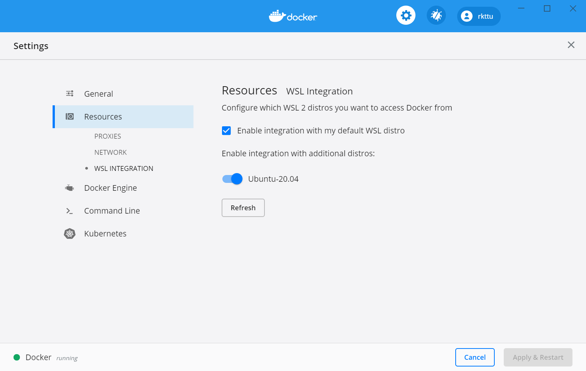

# Docker 설치하기

WSL 2부터는 Docker를 WSL 2 리눅스 안에 직접 설치할 수도 있지만, 이 방법보다는 Docker Desktop for Windows를 이용하는 것을 추천합니다. 이 방법을 사용하면 Docker를 컴퓨터 전체에 걸쳐 딱 한 번만 설치하고 WSL 안이든 밖이든 항상 동일한 환경을 유지하면서 사용할 수 있어 유용합니다.

Docker Desktop for Windows 최신 버전은 Hyper-V VM을 설치하지 않고 WSL v2 환경에 직접 Docker 머신을 설치하고 여러 WSL 배포판에 연결시켜줍니다.

## Docker Desktop for Windows 설치하기

https://hub.docker.com/editions/community/docker-ce-desktop-windows 에서 Stable 버전을 설치합니다.

## WSL 2 연동 상태 확인하고 설정하기

Docker Desktop for Windows를 실행하고 나서 `Settings` -> `Resources` -> `WSL Integrations`로 이동하여 Docker Desktop과 연결하려는 배포판 앞으 스위치를 모두 켜줍니다.

